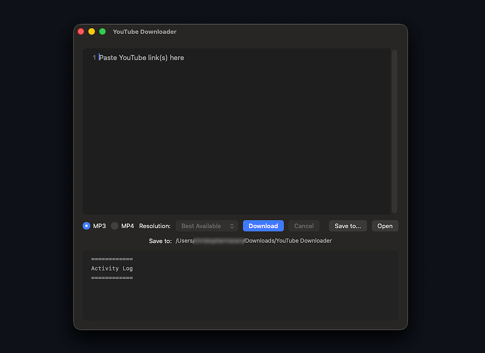

# Topher's YouTube Downloader

A simple YouTube downloader for Mac and Windows.

Download `dist/YouTube Downloader Release.zip`, unzip it, then open the Mac or Windows folder.

The app may ask you to install `yt-dlp` and `ffmpeg` the first time you use it.

## Mac First Open

This app is not Apple-notarized, so macOS will probably block both the app and
the install helper the first time. That is expected for a small app shared
directly outside the App Store.

For `YouTube Downloader`:

1. Open the `Mac` folder.
2. Control-click `YouTube Downloader`.
3. Choose `Open`.
4. If macOS only shows `Move to Trash` and `Done`, click `Done`.
5. Open `System Settings > Privacy & Security`.
6. Scroll to `Security`.
7. Click `Open Anyway` for `YouTube Downloader`.
8. Go back to the `Mac` folder and Control-click `YouTube Downloader` again.
9. Choose `Open`.

For `Install Required Tools.command`:

1. Open the `Mac` folder.
2. Control-click `Install Required Tools.command`.
3. Choose `Open`.
4. If macOS only shows `Move to Trash` and `Done`, click `Done`.
5. Open `System Settings > Privacy & Security`.
6. Scroll to `Security`.
7. Click `Open Anyway` for `Install Required Tools.command`.
8. Go back to the `Mac` folder and Control-click `Install Required Tools.command` again.
9. Choose `Open`.

## Windows First Open

This app is not signed with a paid Windows certificate, so Windows may show a
SmartScreen warning. That is expected for a small app shared directly.

If Windows shows `Windows protected your PC`:

1. Click `More info`.
2. Click `Run anyway`.

If Windows asks for permission to run the install helper, allow it. The helper
installs `yt-dlp` and `ffmpeg`, which the app needs for downloads.

Please only download content you have the rights or permission to save.
